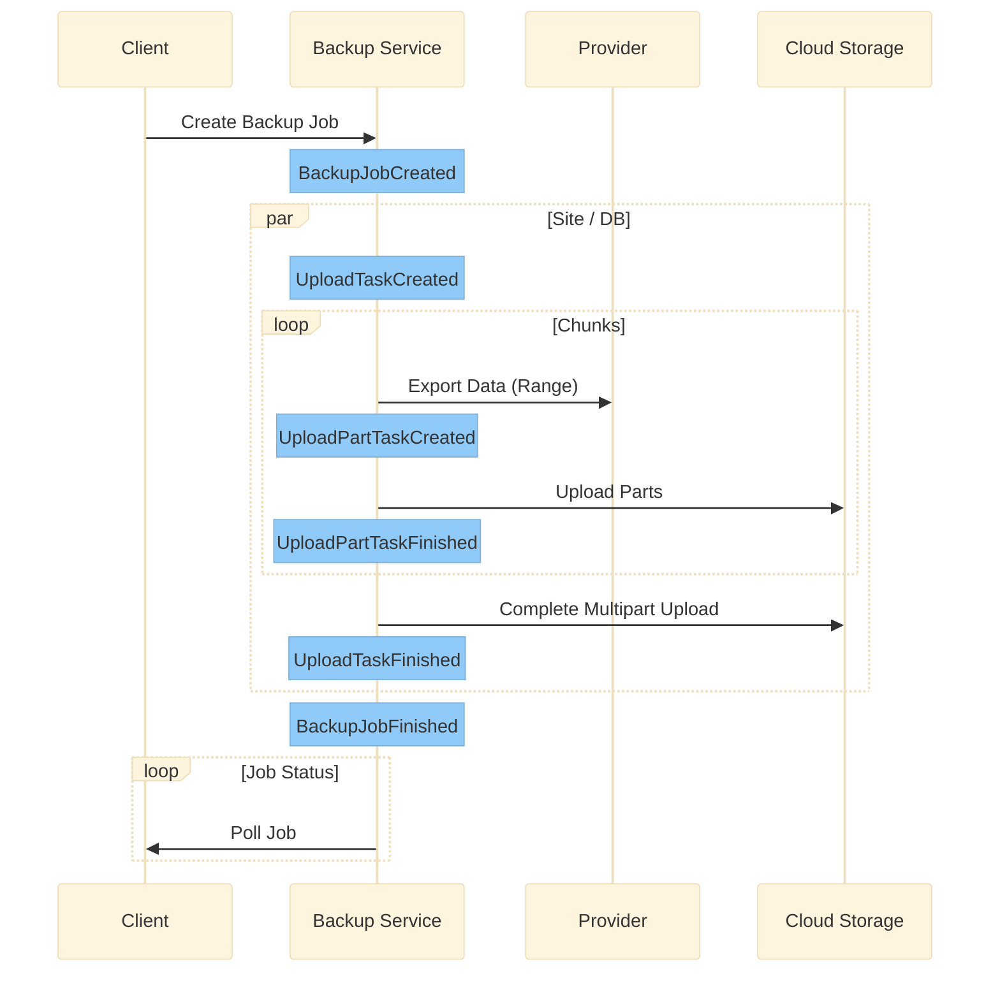
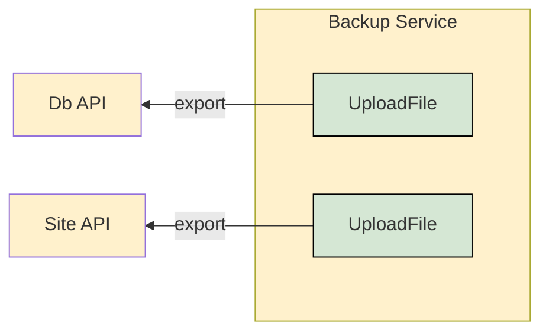
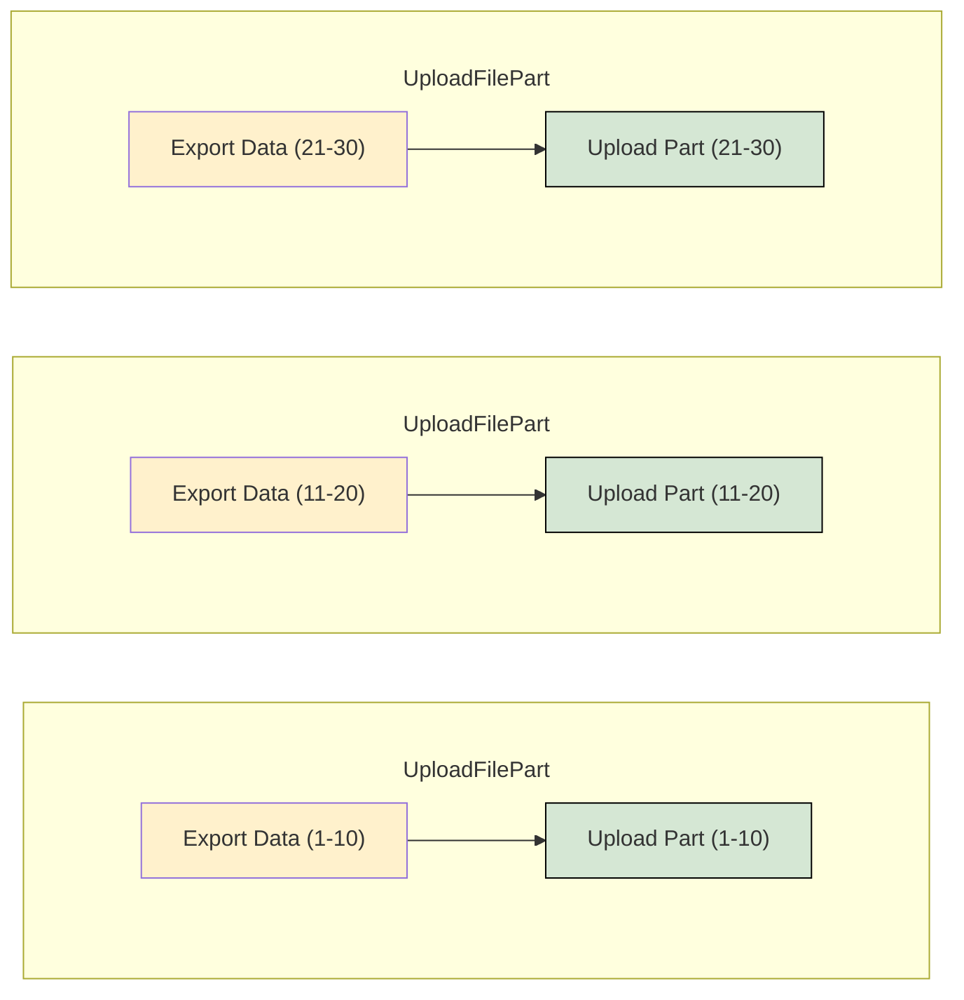
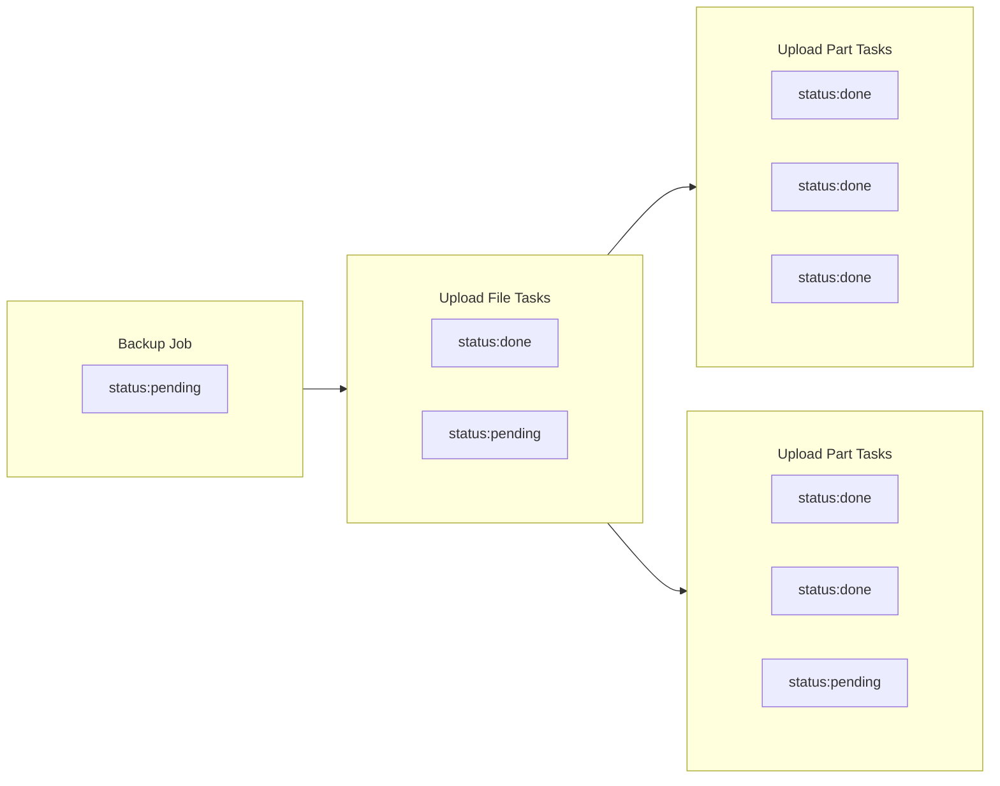
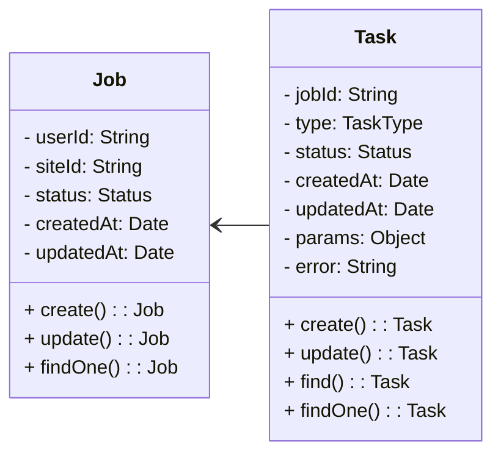

# Backup Service HLD

## Requirements

### Functional Requirements

* Backup generation: Our service should be able to generate a backup by extracting the site’s DB and file system (FS).
* Backup deletion:
  * service should support deleting backups.
  * Deletion should be processed after a specific time. For example:
  generating a backup with deletion time means that after the time the backup will be deleted.
  * UI status reflection: the backup process state should be reflected in the UI in close to
  real-time.
  * Automatic backups: The system should support creating an automatic backup with a deletion date of 60 days pre-configured. The automatic backup process will run every day for each website.

## Non-functional requirements:

* Scalability: Our system should be horizontally scalable with increasing demand.
* Durability: The data shouldn’t be lost.
* Metrics: reporting backup stats, including success/failure counters,
execution/completion times, and any other information that can help us understand what’s going on.
* Retention policy: delete old operations that are no longer relevant, and support different
retention rules for completed and failed operations.
* Retry mechanism
* Execution timeouts - after 6 hours an execution is considered as failed.

## Assumptions

### Download

* Export api streams data as a zip containing all data.
* Export api supports defining chunk size and range.

### Upload

* Data storage supports multi part upload.
* Data storage returns checksum of uploaded files.

## Logical Flow

### Client
* Client sends a request to the Backup Service to create a backup job.
* Job is immediately returned to the client with a *pending* status.
* Client polls the Backup Service to get the job status.
* Poll is finished when the job status is either *done* or *failed*.

### Business Logic

#### API

  * On job creation, job is saved in the Backup Service db with a *pending* status.
  * Job creation triggers the **BackupJobCreated** event
  * Backup Service listens to **BackupJobCreated** and begins the backup flow

#### Backup Job

  * Files are exported from a dynamic list of providers (Site API + DB API)
  * An **UploadFile** task is created for each provider.

#### Upload File Task

* Files are exported in ranges set according to a predefined *chunkSize* param.
* An **UploadPart** task is created in the db for each range of parts.
* An **UploadPartTaskCreated** event is emitted for each task.

### Upload Part Task

* Parts are uploaded to the cloud using the multipart upload API.
* On each upload completion, the checksum is calculated and compared to the uploaded part.
* Once all checksums are verified, **UploadPart** task status is changed to *done* and **UploadPartTaskFinished** event is emitted

* On receiving an **UploadPartTaskFinished** event, Backup Service checks each **UploadPart** task status.
* If all **UploadPart** tasks are *done*, a complete multipart upload request is sent to the cloud and an **UploadFileTaskFinished** event is emitted.
* If any of the **UploadPart** tasks *failed*, Backup Service emits an **UploadFileTaskFinished** event.

* On receiving an **UploadFileTaskFinished** event, Backup Service checks each **UploadFile** task status.
* If all **UploadFile** tasks are *done* or a single one *failed*, Backup Service changes the job status to either *done* or *failed*.

## Data Model

## Tech Stack

### Backup Service DB

* Writes are relatively infrequent and data is small, MongoDB should be sufficient with a potential to scale. At a large scale or when using a solution with an increased data, a write optimized database such as Cassandra can be considered.

### Event Handler 

A message broker with a high throughput and fault such as Kafka should be used.

## Additional Requirements

### Retry mechanism

Easily implemented by re-running the job, skipping each task that was already completed and retrying tasks that failed.

### Scheduler

Should preferably be implemented by an external cron job that runs every X minutes and checks for new jobs to run.

### Execution Timeouts

Can be implemented as a cron job that runs every X minutes and checks for jobs that have been running for more than X hours.

### Polling

Polling can be done by sending a GET request to ``/backup/{jobId}`` every X seconds and checking the status.

A better implementation would be to use long polling, server sent events or websockets which would allow the server to notify the client when the status changes.

Each in the flow event can trigger a notification to the client.

### Size limit

Can should preferably be implemented by retrieving the size of the export before starting the backup.

If necessary, stopping the stream once the size limit is reached should also work.

## Alternative Solutions

### Data via Events

Chunks can be passed via the events which would allow retrying uploads without exporting data. This would increase the load on the event handler and would require a more complex implementation.

### Temporary Data Storage

Chunks can be saved to a temporary storage which performs fast retrievals such as Redis. This would decouple the import and export processes and would allow retrying the export without re-exporting the data. 

The downside is the added infrastructure and complexity. 

It would also reduce durability if the data is not saved to a persistent storage. A persistent storage would make the middleman redundant - data is already uploaded to a persistent storage.

